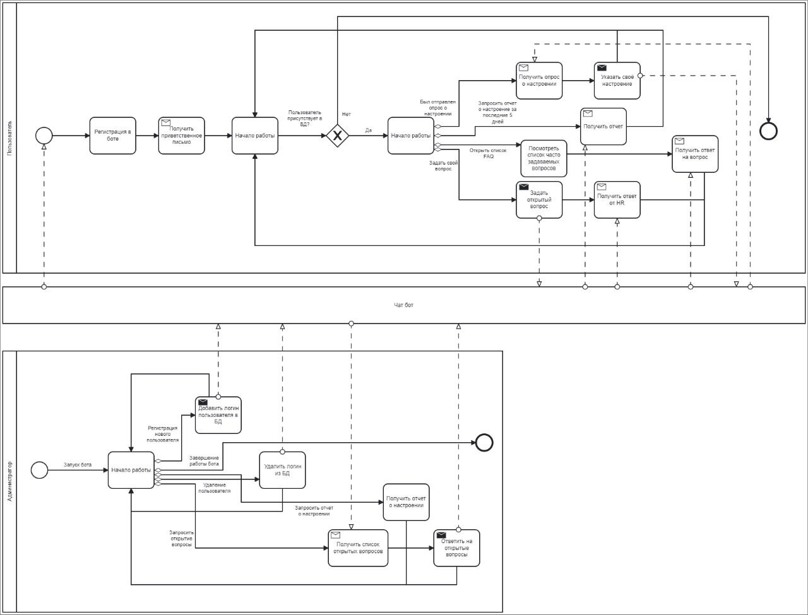
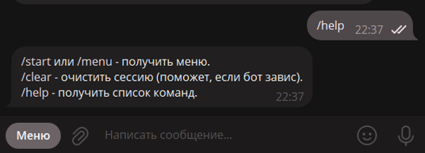
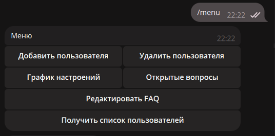
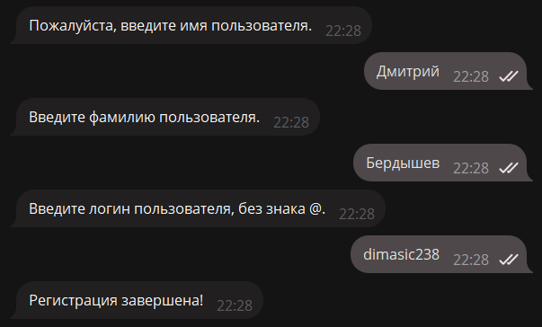
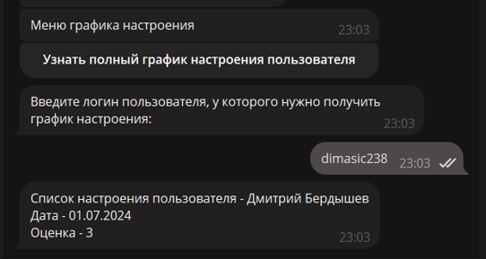
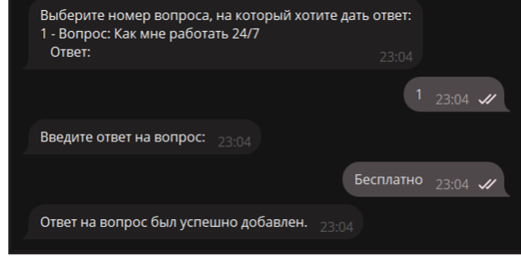
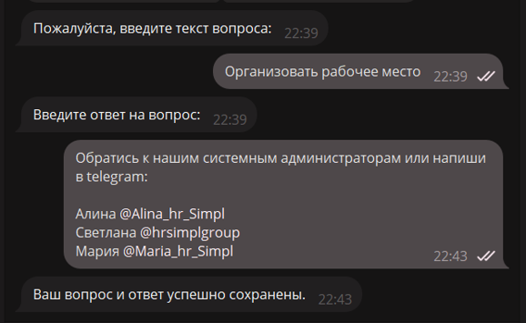

# HelperBot
Телеграм-бот для адаптации сотрудников компании.

## Использованные технологии
Телеграм-бот разработан на платформе .NET 8.0. 
Была использована библиотека Telegram.Bot. 
Был использован фреймворк EntityFramework для работы с СУБД PostgreSQL.

## Функционал
Функционал описан в диаграмме:

Несколько примеров функционала в скринах:

## Запуск
Запустить в терминале: 
docker-compose up --build

Чтобы добавить первого пользователя:
dotnet run --project ConnectToSocket 80
